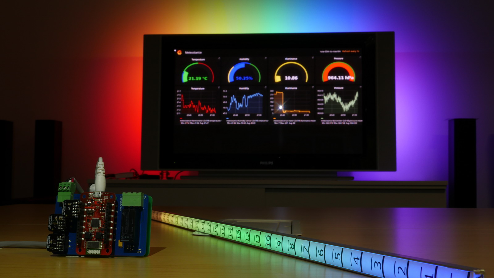

# BigClown Repository bcp-climate-station

## Description

Climate station is one of the basic elements of home automation. Information about temperature, humidity, atmospheric pressure are needed to ensure proper living conditions and the thermal comfort of your home or office.

You need:
* 1x [BigClown Core Module](https://shop.bigclown.com/products/core-module)
* 1x [BigClown Power Module](https://shop.bigclown.com/products/power-module)
* 1x [BigClown Base Module](https://shop.bigclown.com/products/base-module)
* 1x [BigClown Humidity Tag](https://shop.bigclown.com/products/humidity-tag)
* 1x [BigClown Lux Meter Tag](https://shop.bigclown.com/products/lux-meter-tag)
* 1x [BigClown Barometer Tag](https://shop.bigclown.com/products/barometr-tag)
* 1x [AC adapter](https://shop.bigclown.com/products/ac-adaptor-5v-3a)
* 1x 0.5m LED Strip #TODO: add link

For collect and visualization data I use:
* 1x [BigClown Raspberry Pi](https://shop.bigclown.com/products/raspberry-pi-3-set)
* 1x [USB2.0 Cable AM/B-Micro 0.6m](https://shop.bigclown.com/products/usb2-0-cable-am-b-micro-0-6m)
